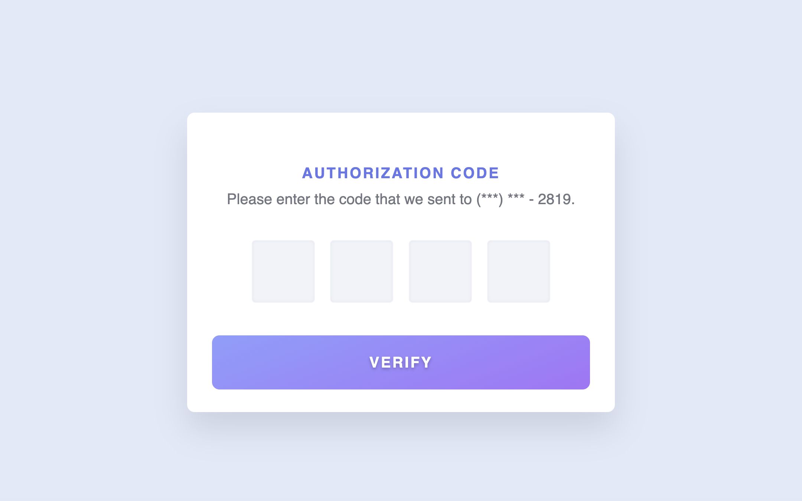

# Authorization App

As a user, I require the ability to input a code after logging in to enhance the security of my account. This will enable me to bolster the safety of my account.

As Developer A, I am currently working on this task and have encountered a bug where the API returns a success response but does not function as expected. I need to rectify this issue to ensure that users can correctly verify the code.

- [x] Let's assume that the correct code has been sent to the user via email or phone SMS, and it is 1234.
- [ ] We have a screen that requires the addition of some code to call the API and verify the data entered by the user.
- [ ] Please note that the Delete button is currently non-functional.
- [ ] The screen for calling the API has not been implemented

